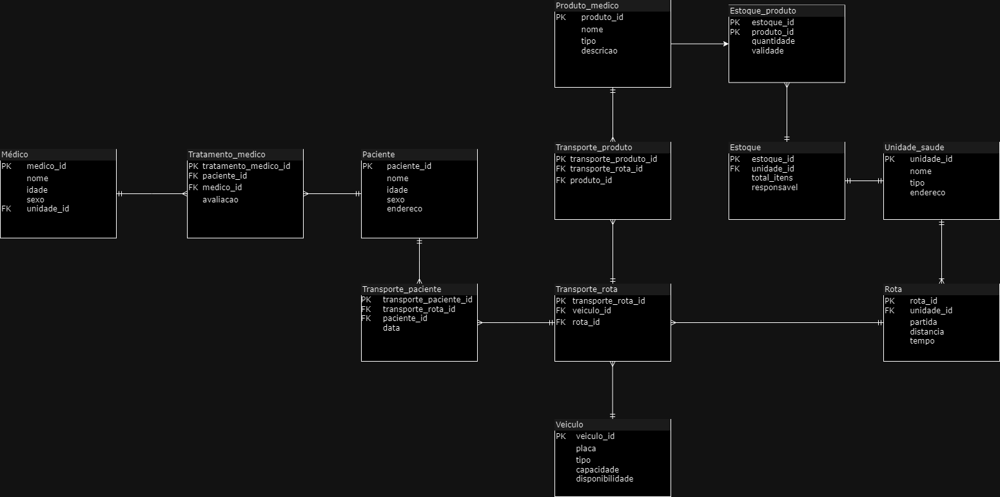
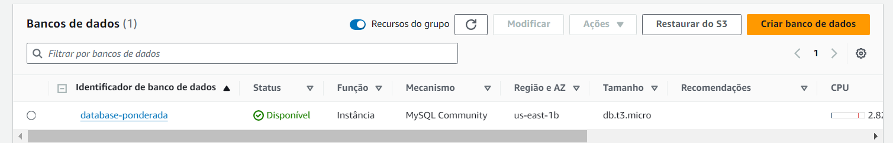
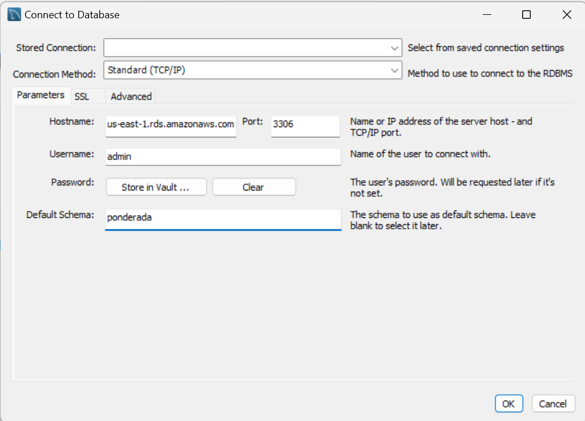
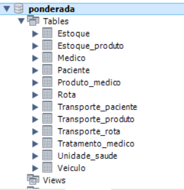
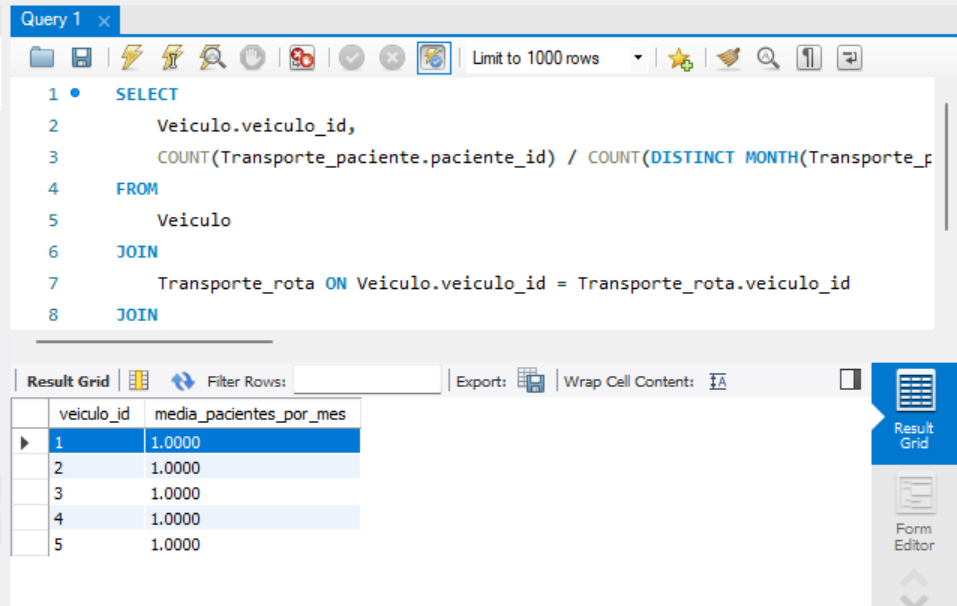

## Modelagem de dados

### 📖 Descrição
Essa atividade contempla a modelagem de um banco de dados e o deploy em nuvem, uilizando a RDS da AWS.

### Modelo Lógico
O modelo lógico planejado, considera as seguintes entidades:
- Médico
- Paciente
- Veículo
- Estoque
- Unidade de saúde
- Rota
- Produto médico

Esse modelo lógico foi construído para capturar todos os aspectos importantes desse sistema de saúde, desde o tratamento dos pacientes até o transporte de pacientes e produtos médicos.

 Figura 1 - Modelo Lógico 

 Fonte: Material produzido pela autora (2024) 

### 🔹Procedimento de Desenvolvimento
**Etapa 1: Criação da RDS** 
Para a criação da RDS, utilizei o padrão gratuito da AWS academy, selecionando o MySQL como mecanimos da instância, adicionando senha e um banco de dados chamado Ponderada. 

 Figura 2 - Imagem do banc de dados 

 Fonte: Material produzido pela autora (2024) 

**Etapa 2: Workbench** 
O segundo passo foi conectar a instância RDS criada, para poder adicionar tabelas e inserir dados.

Para isso, utilizei o aplicativo workbench, em que inseri a senha que foi registrada anteriorimente, o usuário, a porta e o endpoint da instância, fornecido pela AWS. 

 Figura 3 - Conexão com a isntância 

 Fonte: Material produzido pela autora (2024) 

**Etapa 3: Adicionar as tabelas** 
O terceiro passo foi criar um script SQL e utilizá-lo no workbench para a criação das tabelas modeladas anteriormente.

O script dessa etapa pode ser explorado acessando [aqui](https://github.com/Paula-zp/ponderada2-semana3/blob/main/src/tabelas.sql).

Desse modo, o banco de dados `ponderada` ficou com as 12 tabelas planejadas no modelo lógico.

 Figura 4 - Banco de dados 

 Fonte: Material produzido pela autora (2024) 

**Etapa 4: Adicionar dados no banco** 
O quarto passo foi utilizar novamente um script SQL para povoar o banco de dados com informações fictícias. 

O script dessa etapa pode ser explorado acessando [aqui](https://github.com/Paula-zp/ponderada2-semana3/blob/main/src/dados.sql).

**Etapa 5: Consulta** 
O último passo foi fazer a consulta para satisfazer o seguinte pedido:

_"Calcule o número médio de pacientes transportados por veículo por mês"_ 

Para isso, foi construída uma consulta em SQL, que considereva o mês de cada transporte, o número de pacientes transportados e o número de "viagens" que ocorreram. 

O script dessa etapa pode ser explorado acessando [aqui](https://github.com/Paula-zp/ponderada2-semana3/blob/main/src/consulta.sql).

Como o banco de dados contava com poucos registros em cada tabela (5), consequentemente o número médio de pacientes transportados por veículo por mês também foi pequeno. No Workbench, interprete `1.0000 = 1`.

 Figura 5 - Resultado 

 Fonte: Material produzido pela autora (2024) 

### 📁 Estrutura de pastas

Dentre os arquivos presentes na raiz do projeto, definem-se:

- <b>readme.md</b>: explicação geral sobre o projeto (o mesmo que você está lendo agora).

- <b>assets</b>: aqui estarão todas as imagens utilizadas nessa socumentação.

- <b>src</b>: aqui estarão todos os arquivos do projeto.
